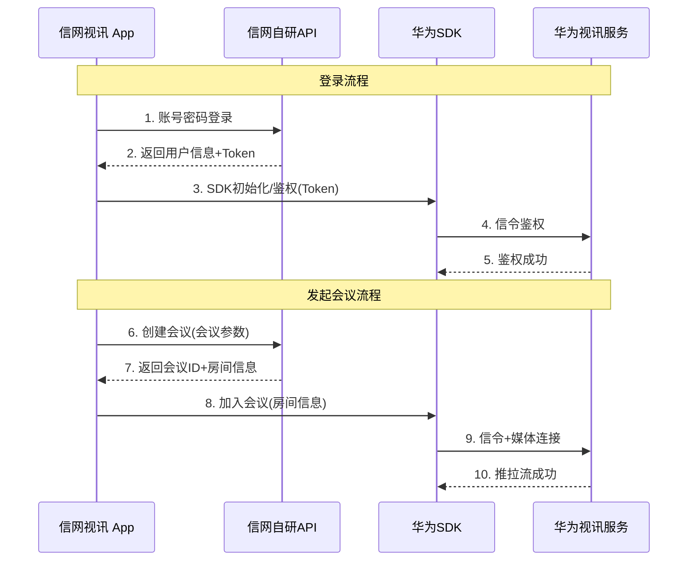

```mermaid
sequenceDiagram
    participant App as 信网视讯 App
    participant SelfAPI as 信网自研API
    participant HuaweiSDK as 华为SDK
    participant HuaweiBackend as 华为视讯服务

    Note over App,HuaweiBackend: 登录流程
    App->>SelfAPI: 1. 账号密码登录
    SelfAPI-->>App: 2. 返回用户信息+Token
    App->>HuaweiSDK: 3. SDK初始化/鉴权(Token)
    HuaweiSDK->>HuaweiBackend: 4. 信令鉴权
    HuaweiBackend-->>HuaweiSDK: 5. 鉴权成功

    Note over App,HuaweiBackend: 发起会议流程
    App->>SelfAPI: 6. 创建会议(会议参数)
    SelfAPI-->>App: 7. 返回会议ID+房间信息
    App->>HuaweiSDK: 8. 加入会议(房间信息)
    HuaweiSDK->>HuaweiBackend: 9. 信令+媒体连接
    HuaweiBackend-->>HuaweiSDK: 10. 推拉流成功
```